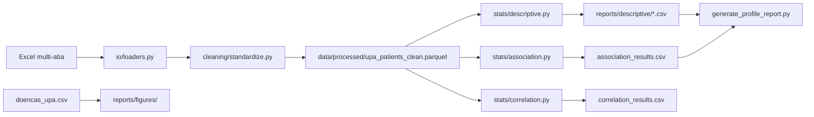

# Plano: Pipeline de Análise Epidemiológica UPA

Implementar o pipeline completo de análise epidemiológica UPA (Fases 1 e 2 do
[plano de desenvolvimento](plano_de_desenvolvimento.md)), adaptando a
arquitetura do `tcr_community` / `nursing-health-reports` para o dataset
`Planilha de dados- Estátistico.xlsx`, com entregáveis CSV/HTML reprodutíveis.

## Contexto

| Item | Estado atual |
|------|--------------|
| Dados principais | `data/raw/Planilha de dados- Estátistico.xlsx` — abas `ABRIL_2025` (155) + `MAIO_2025` (173) = **328 atendimentos** |
| Dados auxiliares | `data/external/doencas_upa.csv` — contagens agregadas por grupo de doença/mês/UPA |
| Código | `src/` vazio; notebook exploratório em `notebooks/processing/00_first_processing.ipynb` (usa ODS antigo, não o Excel atual) |
| Referência | `/home/rwp/code/nurse/tcr_community` — módulos `schemas`, `cleaning`, `pipeline`, `stats`, `reports` |

**Nota sobre amostra:** o plano cita ~528 atendimentos; hoje há 328 linhas
válidas. O pipeline processará o que existe e documentará N efetivo por
variável (missingness é risco analítico explícito no plano).

**Nota sobre tempo de permanência:** a coluna `TEMPO TOTAL DE PERMANÊNCIA NA
UPA` é **categórica** (`ATÉ 6H`, `ATÉ 12H`, …), não numérica. Será
padronizada para testes χ². Adicionalmente, derivaremos `duracao_horas` a
partir de `DATA/INÍCIO/FINAL DA CONSULTA` (327 valores computáveis) para
correlações numéricas da Fase 2.



---

## 0. Change spec (proj-specs-changes)

Criar pasta `.specs/changes/upa-analytics/` com:

- `CHANGE.md` — escopo Fase 1+2, status `in_progress`, claims verificáveis
- `plan.md` — espelho deste plano (tasks)
- `verification.md` — checklist: `uv run pytest`, export scripts, HTML gerado, N=328

Atualizar `.specs/changes/DIGEST.md` com entrada resumida.

---

## 1. Infraestrutura do pacote

### `pyproject.toml`

Adicionar dependências de runtime (espelhando tcr_community):

- `numpy`, `scipy`, `openpyxl`, `pyarrow`, `phik`, `matplotlib`, `seaborn`, `plotly`
- `pytest` em dev; `[build-system]` hatchling; `[tool.hatch.build]` para `src/nurse_epidemic`

### Estrutura alvo

```
src/nurse_epidemic/
├── schemas/columns.py       # COL_*, listas demo/clin/associação
├── io/loaders.py            # load_upa_excel (concat abas + harmonização)
├── cleaning/standardize.py  # SIM/NAO, sexo, desfecho, datas, tempo
├── pipeline/prepare_data.py # raw → interim → processed parquet
├── stats/
│   ├── descriptive.py       # frequency_table, numeric_summary, export
│   ├── association.py       # χ²/Fisher, Mann-Whitney/Kruskal, PhiK
│   ├── correlation.py       # Pearson/Spearman + IC 95%
│   └── clinical_summaries.py # tabelas UPA-específicas
reports/
├── export_clinical_summaries.py
├── generate_profile_report.py
├── descriptive/
└── figures/
tests/
├── test_loaders.py
├── test_standardize.py
└── test_association.py
```

Padrão funcional do tcr_community (sem registry — ainda não existe
implementação no repo; AGENT.md é aspiracional).

---

## 2. Schema e loader

### `src/nurse_epidemic/schemas/columns.py`

Constantes `COL_*` em snake_case + mapa `EXCEL_COL_MAP` para headers originais:

| Excel | COL_* |
|-------|-------|
| `SEXO (F / M)` | `sexo` |
| `IDADE` | `faixa_etaria` |
| `COMORBIDADE  (SIM OU NÃO)` / `COMORBIDADES (SIM OU NÃO)` | `comorbidade` |
| `Diabético`, `Hipertenso`, `TABAGISTA`, `ETILISTA`, … | `diabetico`, `hipertenso`, … |
| `SETOR DESTINADO` | `setor_destinado` |
| `TEMPO TOTAL DE PERMANÊNCIA NA UPA` | `tempo_permanencia` |
| `DESFECHO FINAL` | `desfecho` → derivar `desfecho_padronizado` |
| `Desc. CID Admissão` | `cid_admissao` |

Listas:

- `DEMOGRAPHIC_COLS`: sexo, faixa_etaria
- `CLINICAL_CATEGORICAL_COLS`: comorbidades, hábitos, doenças, setor, tempo, desfecho
- `ASSOCIATION_PREDICTORS`: comorbidade, tabagista, etilista, doenças cardíacas/respiratórias/metabólicas, setor, tempo_permanencia
- `NUMERIC_COLS`: `duracao_horas` (derivada)

### `src/nurse_epidemic/io/loaders.py`

- Ler todas as abas do Excel; concatenar com coluna `mes_coleta`
- Harmonizar: `INÍCIO DA CONSULTA` → `INICIO DA CONSULTA`; unificar colunas de comorbidade
- Remover colunas vazias (`Unnamed:*`, ` `)
- Renomear via `EXCEL_COL_MAP`

---

## 3. Limpeza e pipeline

### `src/nurse_epidemic/cleaning/standardize.py`

Reutilizar/adaptar funções do tcr_community:

- `normalize_text`, `parse_yes_no`, `standardize_genero`
- **`standardize_desfecho_upa`** — mapear para 4 categorias do plano:
  - `ALTA` → `ALTA`
  - `TRANSFERENCIA*` → `INTERNAMENTO`
  - `CAPS`, `EVASAO`, `ENCERRAMENTO*` → `ENCAMINHAMENTO`
  - `OBITO*` (incl. óbito recente) → `OBITO`
- **`standardize_tempo_permanencia`** — normalizar variantes (`ATÉ 6H`, `ATÉ 6H `, …)
- **`compute_duracao_horas`** — datetime início/fim → horas decimais
- `clean_and_standardize(df)` — aplica tudo + cria `desfecho_padronizado`

### `src/nurse_epidemic/pipeline/prepare_data.py`

```
data/raw/Planilha de dados- Estátistico.xlsx
  → data/interim/upa_patients_raw.parquet
  → data/processed/upa_patients_clean.parquet
```

Paths relativos via `Path(__file__).resolve().parents[3]`.

### De-para de normalizações

Módulo `cleaning/depara.py` gera automaticamente em cada execução de
`prepare_data()`:

- `reports/depara_colunas.csv` — Excel → snake_case
- `reports/depara_valores.csv` — valor original → valor normalizado (com n)
- `reports/depara_regras.csv` — regras documentadas
- `docs/depara_normalizacoes.md` — documentação legível para leitura humana

O relatório HTML inclui seção **De-para** com preview das tabelas.

---

## 4. Fase 1 — Estatística descritiva

### `src/nurse_epidemic/stats/descriptive.py`

Portar de tcr_community (funções puras, retornam `pd.DataFrame`):

- `frequency_table` → colunas `valor`, `absoluta`, `relativa` (proporção 0–1)
- `numeric_summary` → `n`, `media`, `mediana`, `min`, `max`, `desvio_padrao`
- `descriptive_report`, `demographic_report`, `clinical_report`, `export_report`

### `src/nurse_epidemic/stats/clinical_summaries.py`

Funções UPA-específicas:

- `desfecho_table`, `setor_destinado_table`, `comorbidades_table`
- `habitos_vida_table` (tabagismo + etilismo)
- `tempo_permanencia_table`
- `doencas_upa_long()` — melt de `doencas_upa.csv` para gráfico temporal

### `reports/export_clinical_summaries.py`

- Prefixos: `demo_*` (sexo, faixa etária), `clin_*` (comorbidades, desfecho, setor, tempo)
- Figuras PNG (≥120 dpi): barras horizontais desfecho, setor, sexo; tendência doencas_upa
- Chama `prepare_data()` se parquet ausente

---

## 5. Fase 2 — Inferência e correlações

### `src/nurse_epidemic/stats/association.py`

Adaptar de tcr_community:

- `chi_square_or_fisher` (Fisher se 2×2 e célula < 5)
- `continuous_vs_categorical` (Mann-Whitney / Kruskal-Wallis) — ex.: `duracao_horas` × `desfecho_padronizado`
- `run_association_battery` — alvo default `desfecho_padronizado`
- `phik_association_matrix` — visão geral mixed-type

Saídas:

- `reports/association_results.csv` — colunas: `variable`, `target`, `test`, `statistic`, `p_value`, `n`, `note`
- `reports/association_results.md` — interpretação em português clínico
- `reports/association_phik_matrix.csv`

### `src/nurse_epidemic/stats/correlation.py` *(novo, exigido pelo plano)*

- `pearson_spearman_pair(df, col_a, col_b)` — escolhe Pearson se normal (Shapiro n≤5000), senão Spearman
- IC 95% via transformação Fisher z (Pearson) ou bootstrap (Spearman)
- `run_correlation_battery` — pares numéricos: `duracao_horas` × codificação ordinal de `faixa_etaria`; matriz entre variáveis numéricas disponíveis
- Saída: `reports/correlation_results.csv` com `variable_a`, `variable_b`, `method`, `r`, `ci_lower`, `ci_upper`, `p_value`, `n`

---

## 6. Relatório HTML

### `reports/generate_profile_report.py`

Adaptar de tcr_community com seções nursing-health-reports:

1. **Associações** — PhiK heatmap + `-log10(p)` de association_results
2. **Descritiva clínica** — CSVs `clin_*` / `demo_*`
3. **Correlações** — tabela correlation_results
4. **Figuras** — auto-include `reports/figures/*.png`
5. **CSVs descritivos** — `<details>` com preview

Dois temas: `profile_report.html` (classic) + `profile_report_minimal.html` (minimal).

`CLINICAL_SUMMARY_FILES` e `FIGURE_CAPTIONS` customizados para UPA.

---

## 7. Testes

`tests/` com pytest:

- Harmonização de colunas entre abas (loader)
- `parse_yes_no`, `standardize_desfecho_upa`, `compute_duracao_horas`
- `chi_square_or_fisher` em frame sintético pequeno
- Smoke: `prepare_data()` produz parquet com 328 linhas

---

## 8. Notebook e documentação

- Atualizar `notebooks/processing/00_first_processing.ipynb` para importar `nurse_epidemic.pipeline.prepare_data` (substituir leitura manual do ODS)
- Não alterar `docs/plano_de_desenvolvimento.md` — é escopo contratual

---

## Comandos de verificação final

```bash
uv sync
uv run ruff check src/ tests/ reports/
uv run ruff format src/ tests/ reports/
uv run pytest tests/
uv run python reports/export_clinical_summaries.py
uv run python reports/generate_profile_report.py
```

Critérios de aceite:

- Parquet processado com 328 registros
- CSVs descritivos + association + correlation gerados
- HTML classic + minimal self-contained
- Testes passando; ruff limpo

---

## Checklist de implementação

- [x] Criar `.specs/changes/upa-analytics/` (CHANGE.md, plan.md, verification.md, DIGEST.md)
- [x] Configurar pyproject.toml (deps, hatchling) e scaffold `src/nurse_epidemic/`
- [x] Implementar `schemas/columns.py` + `io/loaders.py` com harmonização multi-aba
- [x] Implementar `cleaning/standardize.py` + `pipeline/prepare_data.py` → parquet
- [x] Fase 1: `stats/descriptive.py`, `clinical_summaries.py`, export CSVs e figuras
- [x] Fase 2: `stats/association.py` + `correlation.py` → CSVs e markdown
- [x] Adaptar `generate_profile_report.py` (classic + minimal)
- [x] De-para: `cleaning/depara.py` + `docs/depara_normalizacoes.md`
- [x] pytest + ruff + run end-to-end dos scripts de reports
